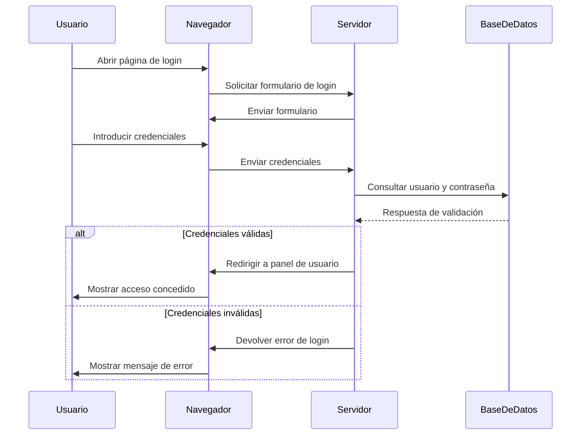

# Diagrama de Secuencia: Login

```mermaid
sequenceDiagram
    participant Usuario
    participant Navegador
    participant Servidor
    participant BaseDeDatos

    Usuario->>Navegador: Abrir página de login
    Navegador->>Servidor: Solicitar formulario de login
    Servidor->>Navegador: Enviar formulario
    Usuario->>Navegador: Introducir credenciales
    Navegador->>Servidor: Enviar credenciales
    Servidor->>BaseDeDatos: Consultar usuario y contraseña
    BaseDeDatos-->>Servidor: Respuesta de validación
    alt Credenciales válidas
        Servidor->>Navegador: Redirigir a panel de usuario
        Navegador->>Usuario: Mostrar acceso concedido
    else Credenciales inválidas
        Servidor->>Navegador: Devolver error de login
        Navegador->>Usuario: Mostrar mensaje de error
    end
```
