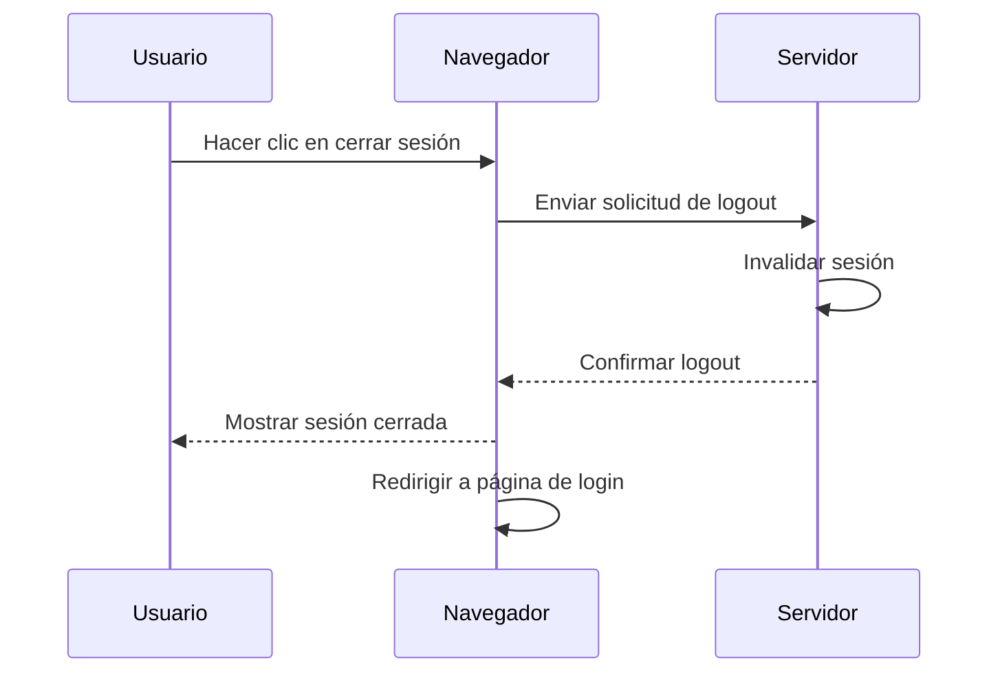

# Diagrama de Secuencia: Logout

```mermaid
sequenceDiagram
    participant Usuario
    participant Navegador
    participant Servidor

    Usuario->>Navegador: Hacer clic en cerrar sesión
    Navegador->>Servidor: Enviar solicitud de logout
    Servidor->>Servidor: Invalidar sesión
    Servidor-->>Navegador: Confirmar logout
    Navegador-->>Usuario: Mostrar sesión cerrada
    Navegador->>Navegador: Redirigir a página de login
```
